# System Structure

## Mermaid

```mermaid
flowchart TB
  A[SMT Factory Integrated Management System]

  A --> Apps[Applications]
  A --> Services[Services]
  A --> Packages[Shared Packages]
  A --> Database[Database]
  A --> Integrations[Integrations]
  A --> Ops[Operations]

  Apps --> Web[Web Console]
  Apps --> Scanner[Scanner Terminal]
  Apps --> Board[Display Board]

  Services --> API[API Service]
  Services --> Worker[Worker]
  Services --> Realtime[Realtime]

  API --> ERP[ERP]
  API --> PMC[PMC]
  API --> WMS[WMS]
  API --> MES[MES]
  API --> Quality[Quality]
  API --> Trace[Traceability]
  API --> Reports[Reports]
  API --> Finance[Finance]
  API --> Admin[Admin]

  Packages --> Types[shared-types]
  Packages --> Rules[business-rules]
  Packages --> Validators[validators]
  Packages --> UIKit[ui-kit]

  Database --> Migrations[migrations]
  Database --> Seeds[seeds]

  Integrations --> Barcode[barcode-scanner]
  Integrations --> Printer[label-printer]
  Integrations --> Shelf[smart-shelf]
  Integrations --> SPI[SPI]
  Integrations --> AOI[AOI]
  Integrations --> ICT[ICT]
  Integrations --> SMT[smt-machine]

  Ops --> Deploy[deployment]
  Ops --> Monitor[monitoring]
  Ops --> Permissions[permissions]
  Ops --> Rollout[rollout]
```

## UI Focus

- `apps/web` is the first usable factory console
- The first screen is a dashboard with module navigation
- Each module surface is designed for dense table work and scan-first flows

## Dependency Note

- Auth, menu permissions, live API data, and transaction persistence still need the backend workers and API service
- The current web app uses demo data for all operational lists and status summaries

## SVG

Open [system-structure.svg](./system-structure.svg).
