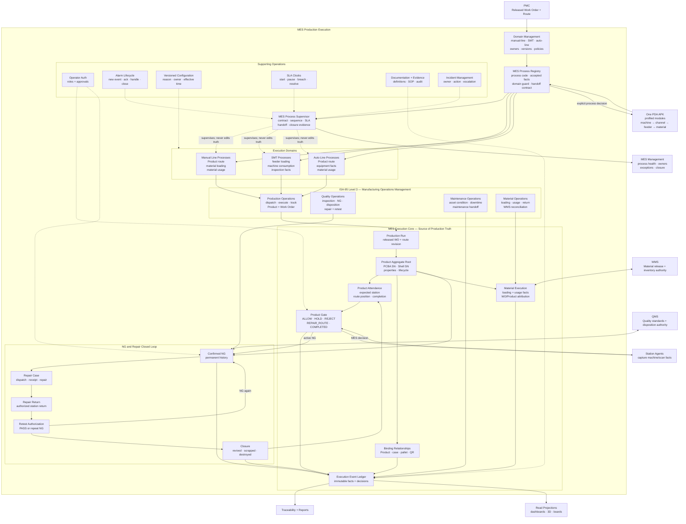

# MES Structure Map

MES converts a released Work Order into traceable Products. Its two primary management themes are **Product execution** and **NG closure**. The surrounding Level-3 structure follows ISA-95 Manufacturing Operations Management: production, quality, maintenance, and material/inventory operations, supported by security, configuration, documentation, and incident management. Pages, Agents, PDAs, and 3D views are clients or projections; they are not independent sources of production truth.



## Management hierarchy

```text
MES
├─ Domain Management
│  ├─ Manual Line
│  ├─ SMT
│  └─ Auto Line
├─ Process Registry
│  ├─ process ownership
│  ├─ accepted Station Facts
│  ├─ domain guard
│  └─ WMS/QMS handoff contract
├─ Process Supervisor
│  ├─ sequence and state health
│  ├─ SLA and stuck-process detection
│  ├─ missing handoff detection
│  └─ evidence-backed closure checks
├─ Manufacturing Operations Management (ISA-95 Level 3)
│  ├─ Production Operations
│  ├─ Quality Operations
│  ├─ Maintenance Operations
│  └─ Material/Inventory Operations
├─ Product Execution
│  ├─ Product and typed identifiers
│  ├─ Product Attendance
│  ├─ Product Gate
│  ├─ bindings and containers
│  └─ material loading and usage facts
├─ NG and Repair
│  ├─ Confirmed NG
│  ├─ Repair Case
│  ├─ Repair Return
│  ├─ Retest Authorization
│  └─ revival, scrap, or destruction closure
└─ Evidence
   ├─ Execution Event Ledger
   ├─ traceability
   ├─ reports
   └─ read-only dashboards and 3D views
```

## Process contract

Every MES process must declare:

1. Process code and domain.
2. Business purpose and accountable owner.
3. Trigger and accepted Station Facts.
4. Required Work Order, Product, operator, station, device, host IP, event time, trace ID, and idempotency key.
5. Permitted decisions and state transitions.
6. NG and dependent-sequence behavior.
7. WMS/QMS/PMC handoffs and acknowledgements.
8. SLA, escalation, closure rule, and closure evidence.
9. Configuration version, reason, owner, and effective period.
10. Immutable audit and read projections.

## Non-negotiable ownership

- MES owns Product execution, route position, Product Gate decisions, production usage attribution, NG state, repair workflow, and closure.
- WMS owns physical material location and inventory balance.
- QMS owns quality standards and disposition authority.
- PMC owns Work Order release and production authorization.
- Station Agents and the PDA capture facts and execute acknowledged decisions; they do not redefine MES processes.
- The Process Supervisor detects and escalates problems but never silently changes production truth.

## Reference basis

- [ISA-95 Standard — Enterprise-Control System Integration](https://www.isa.org/standards-and-publications/isa-standards/isa-95-standard)
- [Siemens — ISA-95 framework and layers](https://www.siemens.com/en-us/technology/isa-95-framework-layers/)
- [MESA Smart Manufacturing Model](https://mesa.org/topics-resources/mesa-model/)

ISA-95 defines MES/MOM at Level 3 and describes production, quality, maintenance, and inventory/material operations. MESA adds lifecycle views including Product, Production, Production Asset, Supply Chain, Workforce, and Order-to-Cash. This MES uses Product as the execution aggregate while keeping the cross-system lifecycle handoffs explicit.
