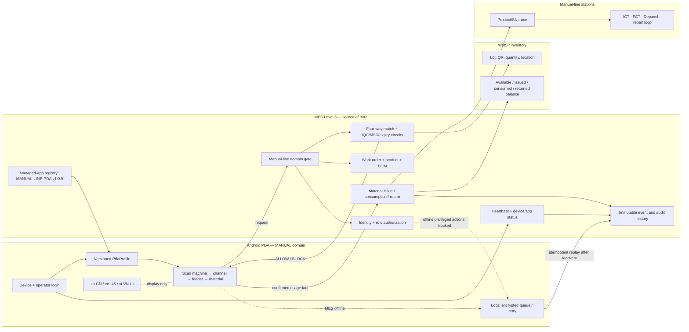

# Manual-line PDA material loading → MES map

The manual-line PDA is an Android edge client. MES owns the manual-line process domain,
work-order/BOM decisions, authorization, inventory truth, consumption history, and audit.

## Required event envelope

Every loading, return, or consumption event must contain: `eventId`, `processDomain=manual-line`,
`stationCode`, `deviceId`, `operatorId`, `workOrder`, `productCode`, `machineCode`,
`channelCode`, `feederCode`, `materialCode`, `lotNo`, `quantity`, `unit`, `occurredAt`,
`source=android-pda`, and the MES decision. The event is append-only and idempotent.

## Standard alignment

- ISA-95 places MES/manufacturing operations management at Level 3 and defines exchanged
  objects and attributes for integration; the PDA therefore captures facts while MES owns
  decisions and process state.
- GS1 traceability uses Critical Tracking Events and Key Data Elements; the loading map
  records the five practical dimensions: who, what, where, when, and why.
- Android managed configurations allow enterprise administrators to control approved-app
  settings remotely; the MES managed-app registry supplies the approved version/profile.

## Release gate

1. Apply migration `222_manual_line_pda_loader_release.sql`.
2. Register each PDA device and assign the `MANUAL` profile.
3. Verify the manual-line API endpoints and WMS lot/quantity responses.
4. Run read-only smoke tests for scan order, duplicate blocking, domain blocking, and
   MES recovery replay.
5. Run one authorized production test and verify the complete material-consumption trace.

