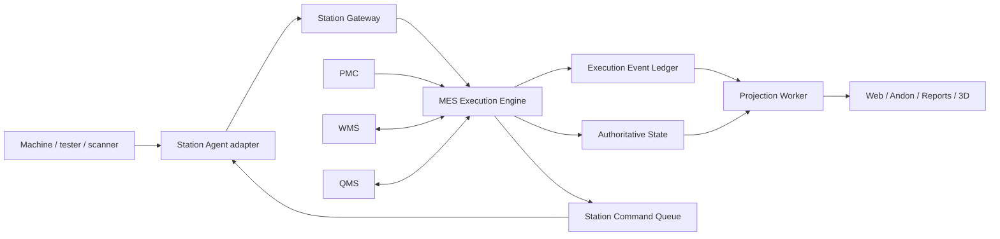

# MES Integrated Architecture

## 1. Mission

MES is the production execution authority between released planning and physical manufacturing. It must answer, for every product identity: what work order it belongs to, where it is, what happened, whether it may proceed, what exception is open, who acted, and how the exception closed.

## 2. Business domains

All MES projects are ranked by contribution to two primary themes: **Product Flow** and **NG Closed Loop**. Each receives a Product score and NG score from 1 to 5. Score 4–5 is primary, 3 is enabling, and 1–2 is supporting. The score must include a written rationale and an accountable owner; it is not a visual preference.

| Domain | Owns | Does not own |
|---|---|---|
| Overview and Control | operational health, line balance, open risks, audited instructions | production facts |
| Production Execution | run, route, station gate, WIP, station acceptance | PMC planning |
| Quality and Exceptions | confirmed NG, Repair Case, SLA, revival, retest, scrap request | quality standards |
| Material and Loading | MES consumption facts, loading verification, line-side use | warehouse balance |
| Packaging and Binding | unit-carton-pallet-work-order relationships | shipment execution |
| Traceability and Reconciliation | immutable genealogy and reconciliation projections | source fact mutation |
| Digital Twin | read-only production projections | commands and corrections |
| Process and Configuration | station master, route revision, rule version, timing policy | transaction history rewrite |

## 3. Runtime structure

The external MES seam is deliberately small:

1. submit a Station Fact;
2. request or execute a business command;
3. acknowledge a command or handover;
4. read a projection.

Route validation, idempotency, NG blocking, repair creation, SLA, authorization, audit, and projection updates remain inside the MES implementation.

## 4. Source-of-truth rules

| Fact | Authority |
|---|---|
| Work order release and schedule | PMC |
| Route execution and current product state | MES |
| Raw measurement and device output | Device / Station Fact |
| Confirmed NG and repair lifecycle | MES |
| Quality specification and final disposition authority | QMS |
| Physical inventory and location | WMS |
| Product genealogy and binding history | MES |
| Dashboard, report, and 3D state | derived projection |

No screen, Agent, 3D scene, or local SQLite database may become a competing authority.

## 5. Core state machines

### Production Run

`DRAFT → RELEASED → RUNNING → HELD → RUNNING → COMPLETED → CLOSED`

Cancellation or voiding is a separately authorized terminal transition with retained history.

### Product route

`WAITING → ACCEPTED_AT_STATION → PROCESSING → PASSED → WAITING_NEXT`

Exception branches: `BLOCKED`, `CONFIRMED_NG`, `REPAIR`, `RETEST`, `SCRAPPED`. A next Station may accept only after its Route Gate passes.

### Repair Case

`DETECTED → CONFIRMED_NG → WAITING_TRANSFER → WAITING_REPAIR_RECEIPT → REPAIRING → WAITING_RETURN_RECEIPT → WAITING_RETEST → CLOSED_PASS`

Terminal alternative: `SCRAPPED`. SLA breach is a condition on the case, not a replacement for its lifecycle state.

## 6. Canonical records

- Work Order and Production Run
- Product Identity and genealogy edges
- Route revision, steps, and Route Gate decisions
- Station Fact and idempotency receipt
- MES Decision and Station Command
- Confirmed NG and Repair Case
- Handover and scan acknowledgement
- Retest Authorization and test attempt
- Binding transaction
- Material consumption fact
- Alarm, SLA Clock, acknowledgement, escalation, and resolution
- Execution Event Ledger and read projections

Current tables remain available during migration. New modules must access them behind the MES domain interface rather than adding direct page-specific SQL or duplicate endpoints.

## 7. UI information architecture

The MES web surface uses two levels:

1. business domain navigation;
2. task pages within the selected domain.

The default page is MES Overview. It exposes health, balance, alarms, repair SLA, and direct entry into each business loop. Existing pages remain compatible while overlapping NG and repair pages are progressively consolidated into one Quality and Exceptions workspace.

## 8. Governance

| Responsibility | Accountable role |
|---|---|
| Route and configuration release | MES administrator + process engineering |
| NG confirmation and disposition | Quality |
| Repair receipt, action, and completion | Repair leader |
| Line hold and restart | Production leader |
| SLA monitoring and escalation | MES automation |
| Agent, integration, and data health | MES IT administrator |

Every configuration version and business transition records actor, role, reason, time, correlation identity, and before/after state.

### Closed-loop gate

Every MES project must define and implement:

`Trigger → Accountable owner → Required action → Verification → Closure → Audit → Review`

A project is not accepted merely because a page, table, alert, or endpoint exists. It remains `NOT_CLOSED_LOOP` if any link is missing, if the next responsible person cannot be identified, if closure can occur without verification, or if history can be overwritten. The MES Overview must eventually expose each project's current loop state and blocked step.

### Operational-definition governance

Every metric, state, threshold, SLA, release rule, alarm, and exception decision must be **事出有因**. A publishable Operational Definition contains:

- canonical code and multilingual name;
- exact meaning and business rationale;
- source-of-truth system and source records;
- formula or decision rule, including inclusion and exclusion rules;
- applicable line, product, station, shift, and time scope;
- accountable owner and required approver;
- version, approval time, effective period, and retirement state.

Every displayed or exported value carries `definitionCode`, `definitionVersion`, `calculatedAt`, and an Evidence Chain. Every MES Decision also carries a reason code and source event references. Draft or unapproved definitions cannot drive production blocking, release, KPI, SLA breach, or management assessment. Changing a definition creates a new version; it never rewrites historical results calculated under an older version.

## 9. Migration sequence

1. Organize the UI into the eight domains without removing existing pages.
2. Consolidate NG, rework, revival, retest, and SLA into one Repair Case projection.
3. Introduce shared command and event contracts in `packages/shared-types`.
4. Move route and exception decisions out of Station Agents into the MES Execution Engine.
5. Add offline outbox, durable acknowledgement, replay, and quarantine at the Station Gateway.
6. Replace page-specific reads with stable projections.
7. Retire compatibility endpoints only after station and UI consumers have migrated and passed smoke tests.

## 10. Acceptance gates

- A product cannot skip a required station.
- Replaying one Station Fact cannot create a second production event.
- A Confirmed NG remains searchable after successful repair and final PASS.
- A Repair Case exposes its owner, current step, age, SLA state, and next required action.
- Disconnect and replay loses no Station Fact.
- All visible text switches cleanly among Chinese, Vietnamese, and English.
- 3D and dashboards cannot mutate production truth.
- Every Product Identity has one explainable current state derived from immutable history.
