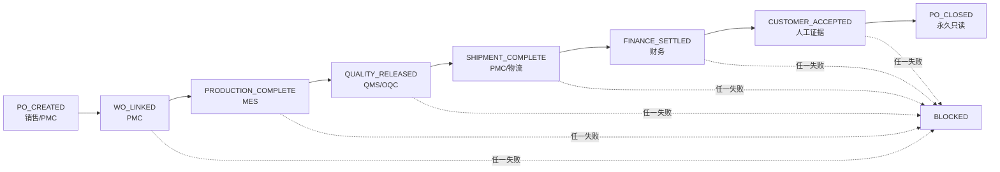

# PO 闭环节点与路由

本流程采用 LangGraph 的节点/边/状态思想记录业务神经网络，但生产执行保持为确定性 API 与 PostgreSQL 事务，不引入非确定性 AI 决策。

| 节点 | 所有者 | 输入 | 判定/属性 | 持久化 | 下一路由 |
|---|---|---|---|---|---|
| PO_CREATED | 销售/PMC | 客户、产品、数量、交期、PO号 | 主数据有效、数量大于0、PO号唯一 | `customer_pos` + 审计 | WO_LINKED |
| WO_LINKED | PMC | PO与工单关系 | 至少一个有效工单 | `work_orders.customer_po_id` | PRODUCTION_COMPLETE |
| PRODUCTION_COMPLETE | MES | 工单计划/完工数量 | 所有工单完成且数量相符 | `work_orders` | QUALITY_RELEASED |
| QUALITY_RELEASED | QMS | OQC批次 | PASS且数量覆盖订单 | `qms_oqc_batches` | SHIPMENT_COMPLETE |
| SHIPMENT_COMPLETE | 物流 | 发货单与工单明细 | 已过账、按工单不超发、总量覆盖PO | `shipments` / `shipment_lines` | FINANCE_SETTLED |
| FINANCE_SETTLED | 财务 | 发票与收款 | 已发货未重复开票、发票已过账、无超收、余额为0 | AR、付款、总账 | CUSTOMER_ACCEPTED |
| CUSTOMER_ACCEPTED | 授权人员 | 原因和证据编号 | 唯一允许人工 PASS 的闭环门禁 | `pmc_po_closure_decisions` | PO_CLOSED |
| PO_CLOSED | 系统 | 六门禁全部PASS | PO及其工单相关变更永久只读 | `customer_pos.closed_at` + 审计 | END |

## 关闭后的统一终止边

已关闭、作废或取消的 PO，以下操作统一返回阻断：

- 新建工单
- 工单直接改状态
- 追加完工报工
- 冻结、改数量或优先级
- 创建或执行工单变更申请
- 创建、审批、交接或接收转线
- 计划下发 MES
- 新建发货
- 新建应收发票

## 人工审批与幂等规则

- 系统门禁不能被人工强制改为 PASS；人工只能设置 FAIL 暂停。
- 客户验收必须由授权人员提交原因和证据后 PASS。
- 每个写操作在事务内完成；重复 PO 号、重复发票、超发、超开票、超收款均阻断。
- 审批恢复后不重复执行副作用；审计记录在成功动作之后写入。
- 测试使用独立编号，结束后删除测试数据并确认无残留。
