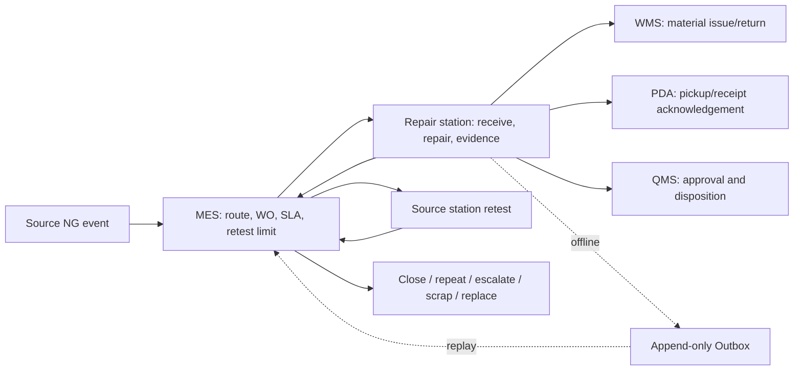

# Repair station functions and workflow (management system)

This is the management-system entry point for the manual-line repair station. The canonical detailed specification is [the station functions and workflow](../../docs/manual-line-repair-station-functions-workflow.md).

## Management view

MES owns the NG closed loop. The repair station executes only the published route and permissions, while PDA manages pickup/receipt acknowledgement, WMS manages material identity and quantity, and QMS manages controlled quality approvals.

## Required management capabilities

- Work-order queue by domain, source station, repair station, priority, SLA, and status.
- NG route and retest policy configuration with revision and authorization.
- Repair-case timeline showing event, SN, bucket, quantity, material, operator, approvals, alarms, and returned station.
- Pickup/return Kanban and PDA acknowledgement.
- SLA/Andon escalation with owner, acknowledgement, escalation level, and resolution.
- Offline Outbox replay, idempotency, and conflict review.
- Immutable audit and Excel/PDF evidence export.

Use the detailed document for the full function list, API contract, states, persistence tables, permissions, and acceptance tests.

## Mermaid source

The standalone source is [manual-line-repair-station-workflow.mmd](../../docs/manual-line-repair-station-workflow.mmd).
