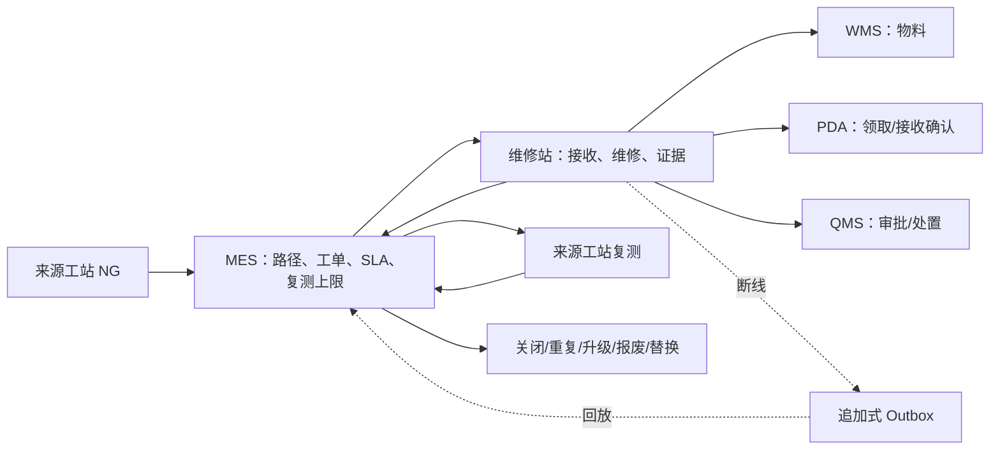

# 维修站功能与工作流（管理系统）

这是管理系统中手动线 NG 维修闭环的中文入口。完整的功能、状态、接口、数据表、权限、断线策略和验收清单见[维修站中文规范](../../docs/manual-line-repair-station-functions-workflow.zh-CN.md)。

管理页面必须支持：按域/工站/优先级/SLA 查看工单；配置 NG 路径和复测策略；查看 SN、NG、桶、数量、物料、操作者、审批、报警的完整时间线；PDA 领取与返回看板；Andon 升级；Outbox 回放和冲突；Excel/PDF 证据导出。

Mermaid 源文件：[manual-line-repair-station-workflow.zh-CN.mmd](../../docs/manual-line-repair-station-workflow.zh-CN.mmd)。
