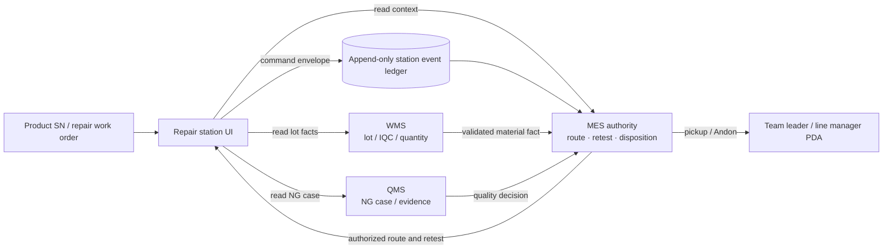

# Repair station integration graph

The repair station is a fact collector and command client. MES owns decisions and
the immutable event ledger; WMS and QMS remain bounded domain systems.

## Command boundary

The station may append `REPAIR_STARTED`, `MATERIAL_USAGE_RECORDED`,
`QMS_EVIDENCE_ATTACHED`, and `RETEST_REQUESTED`. Each command has an `eventId`,
operator, station, SN, timestamp, and `authority: MES`. The station cannot
change a route, increase retests, release, scrap, or delete history.

The `/api/repair-station/context` response deliberately reports per-domain
availability and does not substitute demo data when WMS or QMS is unavailable.
