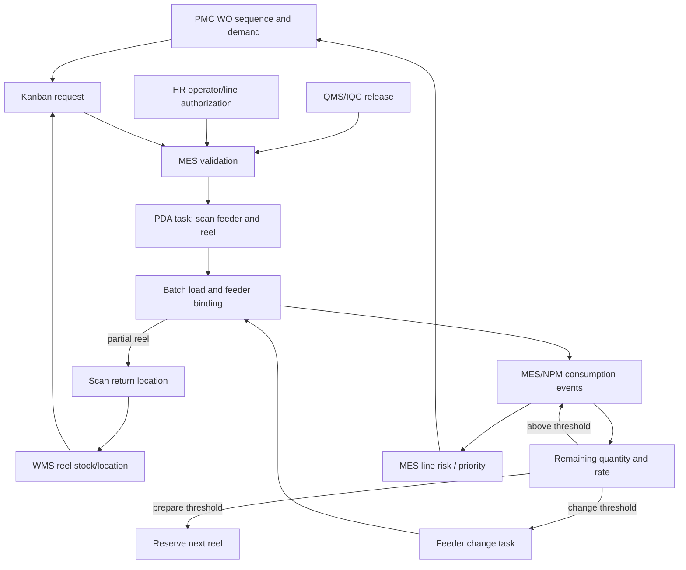

# SMT material-loading graph

## Scope

This graph closes the loop from PMC demand to MES production protection, WMS reel inventory, and PDA execution. MES owns production decisions; WMS owns stock/location; QMS owns release; HR owns operator authorization.

## Competency questions

1. Which active reel is installed on each machine/channel/feeder?
2. How much quantity was received, consumed, and remains on that reel?
3. How many minutes remain before a feeder change is required?
4. Which Kanban demand caused the next reel task?
5. Where is the replacement reel in WMS?
6. Is the reel IQC-released and quantity-known?
7. Which operator performed the load/change/return?
8. Can the line continue without a production-impacting shortage?
9. Which partial reel was returned and where was it stored?
10. Which MES/QMS/PMC decision blocked or released the load?

## Entity types

- `WorkOrder`
- `ProductionLine`
- `Machine`
- `Channel`
- `Feeder`
- `Reel`
- `MaterialLot`
- `KanbanRequest`
- `PdaTask`
- `Operator`
- `WmsLocation`
- `QualityRelease`
- `ConsumptionEvent`
- `FeederChangeEvent`

## Relations

- `WorkOrder RUNS_ON ProductionLine`
- `WorkOrder REQUIRES MaterialLot`
- `MaterialLot REPRESENTS Reel`
- `Reel INSTALLED_ON Feeder`
- `Feeder MOUNTED_ON Machine`
- `Feeder ASSIGNED_TO Channel`
- `Reel STORED_AT WmsLocation`
- `KanbanRequest DEMANDS Reel`
- `PdaTask EXECUTES KanbanRequest`
- `PdaTask AUTHORIZED_FOR Operator`
- `QualityRelease RELEASES MaterialLot`
- `ConsumptionEvent CONSUMES Reel`
- `FeederChangeEvent REPLACES Reel`
- `FeederChangeEvent PROTECTS WorkOrder`

## Task graph

Every event must carry operator, station/PDA, line, WO, timestamp, source, and MES decision. Unknown reel quantity, unreleased IQC, wrong machine/channel/feeder, or unauthorized operator is a hard block.