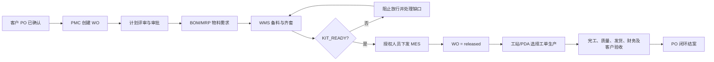

# 工单（WO）创建操作说明

## 1. 适用人员

- PMC 计划员
- PMC 经理
- 工厂经理
- 具有 `pmc.create`、`pmc.manage` 或 `pmc.edit` 权限的授权人员

普通生产操作员只能执行已放行工单，不应创建或放行工单。

## 2. 登录系统

打开：

`http://192.168.6.155:5178/`

工厂经理测试账号：

| 项目 | 内容 |
|---|---|
| 中文登录名 | 蒙营 |
| 系统账号 | MENG_YING |
| 密码 | my |

输入中文名“蒙营”或账号“MENG_YING”均可登录同一个管理员账户。

## 3. 创建前必须准备

创建量产工单前，系统中必须已有：

1. 有效客户资料；
2. 有效产品资料；
3. 已确认且未关闭的客户 PO；
4. 已批准的 BOM 版本；
5. 有效生产线；
6. 计划生产数量；
7. 有效交付日期。

客户 PO 已关闭、作废或取消时，禁止生成新的工单。

## 4. 创建工单

1. 登录系统。
2. 点击左侧 **PMC 工单**。
3. 点击顶部 **创建工单**。
4. 选择工单类型：
   - `1`：量产工单；
   - `2`：试产工单；
   - `3`：返工/其他受控工单。
5. 量产工单选择对应的客户 PO。
6. 选择产品。
7. 选择生产线。
8. 选择已批准的 BOM。
9. 输入计划数量。
10. 确认交付日期。
11. 点击 **创建工单**。

系统自动生成唯一工单号。新工单初始状态为 `draft`（草稿）。

## 5. 工单号规则

工单号由系统自动分配，操作人员不得手工修改或重复使用。

系统会记录：

- 工单号；
- 客户 PO；
- 产品；
- BOM；
- 生产线；
- 计划数量；
- 交付日期；
- 创建人；
- 创建时间；
- 初始状态。

## 6. 创建后的审核流程

工单创建后不能直接投入生产，必须依次完成：

1. PMC 计划评审；
2. 生产能力评审；
3. 物料需求计算；
4. WMS 备料和齐套确认；
5. 质量及工程条件确认；
6. 必要审批完成；
7. 计划状态达到 `KIT_READY`；
8. 授权人员执行 **下发 MES**；
9. 工单状态变为 `released`。

只有 `released` 状态的工单可以由生产工站和 PDA 选择执行。

## 7. 工单状态说明

| 状态 | 中文含义 | 是否允许生产 |
|---|---|---|
| `draft` | 草稿 | 否 |
| `released` | 已放行 | 是 |
| `running` | 生产中 | 是 |
| `completed` | 已完工 | 不允许新增生产 |
| `closed` | 已结案 | 否，永久只读 |
| `voided` | 已作废 | 否 |
| `cancelled` | 已取消 | 否 |

## 8. 放行规则

工单放行接口为：

`POST /pmc/plans/:id/release-to-mes`

放行前系统自动检查：

- 计划存在；
- 计划已完成审批；
- 物料已经齐套；
- 计划状态为 `KIT_READY`；
- 工单仍关联有效、未关闭的客户 PO。

任意条件不满足时，系统必须阻止放行并显示原因。

## 9. 常见阻断原因

| 提示或现象 | 处理方法 |
|---|---|
| 找不到客户 PO | 先在 PO 管理中创建并确认 PO |
| PO 已关闭 | 不可继续使用，必须选择有效 PO |
| 找不到产品 | 先维护产品主数据 |
| 找不到生产线 | 先启用正确生产线 |
| BOM 不存在或未批准 | 先完成 BOM 审批 |
| 数量无效 | 输入大于 0 的计划数量 |
| 交付日期无效 | 选择有效日期 |
| 无创建工单权限 | 由管理员分配 PMC 权限 |
| 物料未齐套 | WMS 完成备料、检验和齐套确认 |
| 计划未批准 | 完成 PMC、生产及相关部门审批 |

## 10. 禁止事项

- 禁止绕过客户 PO 创建量产工单；
- 禁止使用已关闭、作废或取消的 PO；
- 禁止手工编写或修改工单号；
- 禁止跳过 BOM、物料齐套或审批直接放行；
- 禁止在 PO 关闭后修改关联工单；
- 禁止删除已发生的工单审计记录；
- 禁止使用测试数据执行正式生产。

## 11. 审计和追溯

系统必须永久保留：

- 工单创建记录；
- 工单号分配记录；
- 状态变化记录；
- 计划评审和审批记录；
- BOM 与物料齐套记录；
- MES 放行记录；
- 创建人、审批人和操作时间；
- 变更、取消、转线和结案记录。

## 12. 完整流程

