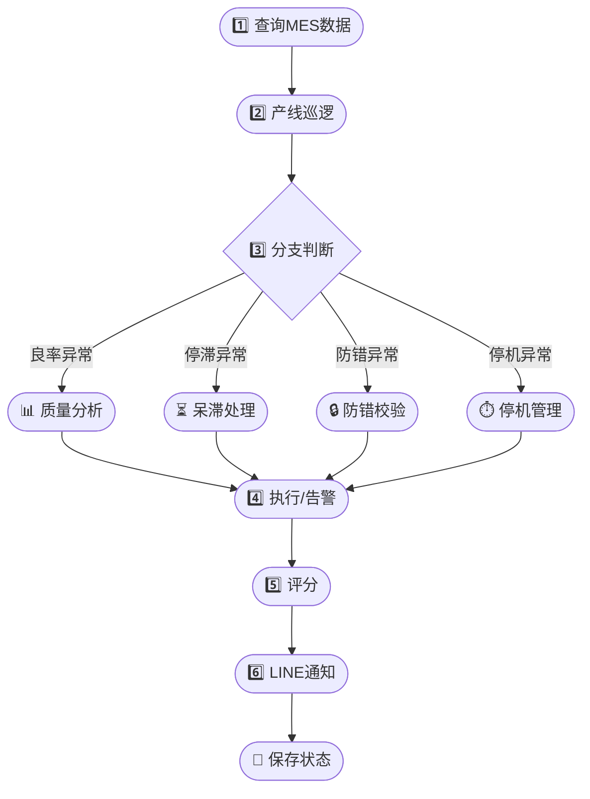

# MES AI Manager — 制造执行AI管理员

## Agent Profile

**Name**: MES AI Manager (`制造执行AI管理员`)
**Model**: Ornith-1.0-9B (local, privacy-first, no data leaves factory)
**Execution**: PowerShell scripts + Node.js DB queries + API calls
**Escalation**: LINE notifications for critical decisions; human-in-the-loop for high-stakes actions
**Memory**: Last-state JSON for delta detection between patrol cycles
**Audit**: Every action logged with timestamp, operator, reason

---

## Architecture

```
┌─────────────────────────────────────────────┐
│  Scheduler (Windows Task Scheduler / cron)  │
│  Every 15 min: line patrol, event monitor   │
│  07:15: morning MES digest to LINE          │
│  17:00: daily yield & OEE report            │
│  Monday 08:00: weekly quality review        │
└──────────────┬──────────────────────────────┘
               │
               ▼
┌─────────────────────────────────────────────┐
│  mes-manager.js (Node.js)                  │
│  1. Query DB (mes-query.js)                │
│  2. Feed Ornith for reasoning              │
│  3. Parse decisions                        │
│  4. Execute via API or log                 │
│  5. Send LINE alerts                       │
└──────────────┬──────────────────────────────┘
               │
      ┌────────┼──────────┐
      ▼        ▼          ▼
   PostgreSQL  Ornith    LINE API
   (data)    (reason)  (alerts)
```

---

## Core Skills

### Skill 1: Production Line Patrol Agent

**Trigger**: Every 15 minutes + on-demand

**Checks**:

1. **Line Status Anomaly Detection**
   - Query: `GET /mes/lines` → check each line status
   - If a line has been `down` > 30 min without a `downtime` record → 🟡 flag: missing downtime log
   - If a line has been `idle` > 2h with an active `released` work order → 🔴 LINE alert: line should be running
   - If a line status is `running` but no station events in the last 15 min → 🟡 warning: possible data gap

2. **Run Health Check**
   - Query: `GET /mes/runs?status=running`
   - For each active run:
     - CompletedQty / PlannedQty progress
     - If < 50% completion but > 50% of scheduled time elapsed → 🟡 flag for production manager
     - If 0 completed qty in last 1h → 🔴 possible stoppage

3. **Changeover Monitor**
   - If line status = `changeover` > 1h → 🟡 status check: changeover taking too long
   - If changeover > 2h → 🔴 LINE alert to line supervisor

| Condition | Action | Channel |
|---|---|---|
| Down > 30min, no downtime log | 🟡 Log warning | Patrol log |
| Idle > 2h with released WO | 🔴 LINE alert | LINE to production manager |
| Running but no events 15min | 🟡 Data gap flag | Patrol log |
| Run < 50% at > 50% time elapsed | 🟡 Flag PM | LINE to PMC |
| Run zero output > 1h | 🔴 Stoppage alert | LINE to line supervisor |
| Changeover > 1h | 🟡 Status check | Patrol log |
| Changeover > 2h | 🔴 Escalate | LINE to supervisor |

**Tool**: `GET /mes/lines` + `GET /mes/runs` + `GET /mes/downtimes`

---

### Skill 2: Station Yield & Quality Agent

**Trigger**: Every 15-minute patrol + on-demand per station

**Analysis**:

```
FOR each station type with recent events:
  1. Calculate yield: PASS / (PASS + FAIL) for last 1h / 8h / 24h
  2. Compare against station yield baseline:
     - SPI: target ≥ 95%
     - AOI: target ≥ 97%
     - ICT: target ≥ 98%
     - FCT: target ≥ 98%
     - Assembly stations: target ≥ 99.5%
  3. Yield drop > 5% from baseline in 1h → 🟡 warning
     Yield drop > 10% → 🔴 LINE alert
  4. Defect pareto: top 3 defect codes in last 24h
```

**Defect Trend Detection**:
- Same defect code appearing 3+ times in 1h at same station → 🟡 flag for engineer review
- Same defect code on same product across different stations → 🔴 potential systemic issue

**Yield Dashboard (LINE)**:
```
📊 良率快报 {time}
━━━━━━━━━━━━━━━━━━
SMT-1F:
  SPI: 97.2% (baseline 95%) ✅
  AOI: 94.1% (baseline 97%) ⚠️ ↓3%
    Top defect: TOMBSTONE (12次)
  ICT: 99.1% ✅
  FCT: 98.5% ✅
SMT-2F:
  SPI: 96.8% ✅
  AOI: 91.3% (baseline 97%) 🚨 ↓5.7%
    Top defect: BRIDGE (8次), MISSING (5次)
```

| Condition | Action | Channel |
|---|---|---|
| Yield < baseline - 5% over 1h | 🟡 Warning | Patrol log |
| Yield < baseline - 10% | 🔴 LINE alert | LINE to QA engineer |
| Same defect 3x/h same station | 🟡 Flag engineer | Patrol log |
| Same defect cross-station | 🔴 Systemic flag | LINE to process engineer |

**Tool**: `GET /mes/events?eventType=inspection` per station + aggregate

---

### Skill 3: Feeder Binding Guardian

**Trigger**: Every patrol cycle + when new binding is created

**Pre-Flight Checks**:

| Check | Condition | Fail Action |
|---|---|---|
| Fool-proof rule match | Feeder slot material matches rule | 🚨 BLOCK — alert line operator |
| Reel MSD status | Material lot not MSD-expired | 🚨 BLOCK — alert supervisor |
| Reel quantity | Received qty - reserved qty >= needed | 🟡 Flag if low |
| Work order match | Reel allocated to this WO | 🚨 BLOCK — wrong material |
| Feeder slot conflict | No other active binding on same slot | 🚨 BLOCK — slot in use |

**Binding Verification**:
```
FOR each active binding:
  1. Look up fool-proof rule for [stationCode + feederSlot]
  2. If rule exists AND rule.materialCode != binding.materialCode → 🔴 MISMATCH ALERT
  3. Check reel_code against material_lots for MSD expiry
  4. Log binding audit
```

**Auto-Correction** (if confidence > 90%):
- Mismatch detected: notify line operator via LINE with correct material suggestion
- If duplicate slot binding: notify to unbind old binding first

**Tool**: `GET /mes/fool-proof-rules` + `GET /mes/feeder-bindings`

---

### Skill 4: PCB Serial Tracker

**Trigger**: Patrol cycle + new PCB serial registration

**Routing Verification**:
```
FOR each PCB serial with status = 'wip':
  1. Load station flow: GET /mes/station-flow?sn={serialNo}
  2. Load process route for product (by WO → productCode)
  3. Compare actual station order vs route:
     - MISSING_STATION: SKIP detected (PCB bypassed required station)
     - EXTRA_STATION: PCB appeared at wrong station
     - REVERSED_ORDER: PCB went backward in route
     - DUPLICATE_EVENT: PCB scanned twice at same station
```

**Stagnation Check** (per PCB):
- Load threshold for current station from stagnation thresholds
- If dwell > threshold → mark stagnation alert
- If dwell > critical threshold → LINE alert

| Finding | Action | Escalation |
|---|---|---|
| Missing station (skip) | 🔴 BLOCK line | LINE to QC + production |
| Wrong station | 🟡 Warning + reroute | LINE to operator |
| Backward movement | 🔴 BLOCK investigation | LINE to process engineer |
| Stagnation > threshold | 🟡 Flag | Patrol log |
| Stagnation > critical | 🔴 LINE alert | LINE to supervisor |

**Tool**: `GET /mes/pcb-serials` + `GET /mes/station-flow` + `GET /mes/trace/{serialNo}`

---

### Skill 5: Stagnation Manager

**Trigger**: Every 15-min patrol + when new stagnation detected

**Stagnation Level Calculation**:
```javascript
const LEVELS = {
  normal:   { max: threshold.warningMinutes },
  warning:  { max: threshold.alertMinutes },
  alert:    { max: threshold.criticalMinutes },
  critical: { max: Infinity },
};

function calcLevel(dwellMinutes, threshold) {
  if (dwellMinutes >= threshold.criticalMinutes) return "critical";
  if (dwellMinutes >= threshold.alertMinutes)    return "alert";
  if (dwellMinutes >= threshold.warningMinutes)   return "warning";
  return "normal";
}
```

**Auto-Actions by Level**:

| Level | Dwell Time | Action |
|---|---|---|
| 🟢 normal | < warning | Log only |
| 🟡 warning | warning ~ alert | Flag in patrol log |
| 🟠 alert | alert ~ critical | LINE to station operator |
| 🔴 critical | ≥ critical | LINE to line supervisor + QC |

**Stagnation Resolution**:
```
FOR each alert/critical stagnation:
  1. Check if PCB has recent station event → maybe resolved but not updated
  2. If still stagnant:
     - Propose resolution: resume flow / scrap / rework
     - If PCB has upstream FAIL events → recommend rework before resuming
     - If PCB idle > 7 days → recommend scrap disposition
  3. Log recommendation → patrol log
```

**Overdue PCB Report** (daily):
- PCBs with overdueMonths > 0 → summary for management
- By customer, product model, station origin

**Tool**: `GET /mes/stagnation` + `GET /mes/stagnation/alerts` + `PATCH /mes/stagnation/{id}/resolve`

---

### Skill 6: Scrap Manager Agent

**Trigger**: New scrap record created + weekly scrap analysis

**Scrap Triage**:

| Condition | Auto Action | Escalation |
|---|---|---|
| scrapReasonCode = "IQC_REJECTED" and quantity <= 100 | ✅ Auto-approve | Log only |
| scrapReasonCode = "DAMAGED" and quantity <= 10 | ✅ Auto-approve | Log only |
| scrapReasonCode = "EXPIRED" | ✅ Auto-approve | Log only |
| quantity > 100 or value > $500 | ⏳ Pending | LINE to QA manager |
| Same SN scrapped twice | 🚨 BLOCK | LINE to supervisor anomaly |
| Batch scrap (same WO, same reason > 50pcs) | 🟡 Flag | LINE to production manager |

**Scrap Trend Analysis** (weekly):
- Top scrap reasons by line
- Scrap rate = scrapped qty / total produced qty per WO
- If scrap rate > 5% for any WO → 🚨 LINE alert to QA

**Weekly Scrap Summary**:
```
📋 报废周报 (Week {week})
━━━━━━━━━━━━━━━━━━
SMT-1F: 152pcs (0.8%)
  TOMBSTONE: 45pcs
  BRIDGE: 38pcs
  MISSING: 22pcs
SMT-2F: 89pcs (0.5%)
  BRIDGE: 31pcs
  SCRATCH: 18pcs
趋势: SMT-1F tombstone ↑23% vs last week ⚠️
```

**Tool**: `GET /mes/scraps` + `PATCH /mes/scraps/{id}`

---

### Skill 7: First Article Inspection Agent

**Trigger**: New inspection created + when patrol finds a released WO with no FA inspection

**WO Readiness Gate**:
```
FOR each released WO:
  Check: Has first article inspection been performed for this WO?
  If NO and WO.releasedAt > 2h ago → 🟡 remind QC team
  If NO and WO.releasedAt > 4h ago → 🔴 LINE to QC manager
```

**Inspection Result Validation**:
```
FOR each first article inspection:
  1. Check all checkItems — any FAIL?
  2. If overall result = FAIL:
     - BLOCK line start
     - LINE alert to line supervisor + QC
     - Suggest re-inspection after correction
  3. If PASS:
     - No action needed (log only)
```

| Condition | Action |
|---|---|
| WO released > 2h, no FA | 🟡 Remind QC |
| WO released > 4h, no FA | 🔴 LINE QC manager |
| FA result = FAIL | 🚨 BLOCK line, LINE alert |
| FA result = PASS | ✅ Log only |

**Tool**: `GET /mes/first-article-inspections` + `GET /mes/runs`

---

### Skill 8: Material Verification Agent

**Trigger**: New material verification record + patrol cycle

**Match Analysis**:
```
FOR each material verification record:
  If matchResult = "FAIL":
    → Check: is there a fool-proof rule for [stationCode + feederSlot]?
    → If rule exists: rule.materialCode vs actual material code
      → Mismatch: 🔴 LINE alert — wrong material in slot
      → Match but operator error: 🟡 flag retraining
    → If no rule: log warning — missing fool-proof rule?
```

**Tool**: `GET /mes/material-verifications` + `GET /mes/fool-proof-rules`

---

### Skill 9: Downtime Manager

**Trigger**: New downtime opened + patrol cycle

**Downtime Classification**:
```javascript
const DOWNTIME_THRESHOLDS = {
  short:    { max: 5,  action: "log" },        // < 5 min
  medium:   { max: 30, action: "flag" },       // 5-30 min
  long:     { max: 120, action: "line_alert" },// 30-120 min
  critical: { max: Infinity, action: "manager" },// > 120 min
};
```

**Auto-Actions**:

| Duration | Level | Action |
|---|---|---|
| < 5 min | 🟢 Short | Log only |
| 5-30 min | 🟡 Medium | Include in patrol summary |
| 30-120 min | 🟠 Long | LINE to line supervisor |
| > 120 min | 🔴 Critical | LINE to production manager |

**Downtime Reason Analysis**:
- If same reason_code appears > 3 times in a day on same line → 🔴 repeat failure — LINE to maintenance
- If downtime reason = "SETUP" and duration > 60 min → 🟡 suggest SMED review
- If open downtime > 30 min and no close action → 🟡 flag to close or extend

**Tool**: `GET /mes/downtimes` + `PATCH /mes/downtimes/{id}`

---

### Skill 10: OEE Calculator

**Trigger**: Every hour + end of shift + on-demand

**Calculation**:
```
OEE = Availability × Performance × Quality

Availability = OperatingTime / PlannedProductionTime
  - OperatingTime = PlannedProductionTime - Downtime
  - Downtime = sum of all closed/opened downtimes in period

Performance = (TotalPcs / OperatingTime) / IdealCycleTime
  - TotalPcs = sum of PASS + FAIL events at output station

Quality = GoodPcs / TotalPcs
  - GoodPcs = PASS events at output station
  - TotalPcs = PASS + FAIL events at all stations
```

**OEE Thresholds**:

| OEE Range | Rating | Action |
|---|---|---|
| ≥ 85% | World Class ✅ | Log only |
| 70-84% | Acceptable 🟡 | Include in daily report |
| 50-69% | Needs Improvement 🟠 | LINE to production manager |
| < 50% | Critical 🔴 | LINE to factory manager |

**Line OEE Report** (end of shift):
```
📊 OEE 快报 {line} {shift}
━━━━━━━━━━━━━━━━━━
运行时间: 7.5h / 8.0h (93.8%)
总产出: 2,450pcs
良品: 2,380pcs (97.1%)
━━━━━━━━━━━━━━━━━━
OEE: 93.8% × (2450/7.5/360) × 97.1% = 82.6% 🟡
瓶颈工位: AOI-01 (cycle time 28s vs target 22s)
```

**Tool**: `GET /mes/runs/{id}` (includes OEE components) + `GET /mes/events` per time window

---

### Skill 11: Fool-Proof Guardian

**Trigger**: Patrol cycle + when new fool-proof rule is created/modified

**Rule Coverage Check**:
```
FOR each active line:
  1. Get all stations on the line
  2. Get all feeders per station
  3. Check: does each feeder position have a fool-proof rule?
  4. Coverage rate = rules_count / feeder_count
  5. If coverage < 80% → 🟡 flag: incomplete fool-proof coverage
  6. If coverage < 50% → 🟠 LINE to process engineer
```

**Rule Conflict Detection**:
- Same materialCode assigned to different feederSlots on same station → 🟡 potential conflict
- Same feederSlot has overlapping active rules → 🟠 alert: rule conflict

| Condition | Action |
|---|---|
| Coverage < 80% | 🟡 Flag in patrol log |
| Coverage < 50% | 🟠 LINE to process engineer |
| Material in 2+ slots same station | 🟡 Log conflict |
| Feeder slot rule overlap | 🟠 Alert engineer |

**Tool**: `GET /mes/fool-proof-rules` + `GET /mes/stations`

---

### Skill 12: Retest & Rework Agent

**Trigger**: Patrol cycle + when PCB has fail event

**Retest Rule Enforcement**:
```
FOR each FAIL event at any station:
  1. Check retest rules for this station type + defect code
  2. If rule exists:
     - Max retries allowed vs actual retry count
     - If retries < max → allow retest
     - If retries >= max → BLOCK further retest, route to repair
  3. If no retest rule → warn: missing retest rule
```

**Rework Loop Detection**:
- Same PCB serial retested 3+ times in 1h → 🟡 loop detected
- Same PCB serial at repair station > 30 min → 🟡 flag repair delay

**Tool**: `GET /mes/events?pcbSerial=` + retest rules from API

---

### Skill 13: Upstream NG Check Agent

**Trigger**: On each station event POST + patrol cycle

**Logic**:
```
FOR each FAIL event at upstream station:
  Check if downstream stations received this PCB later
  If downstream station PASSED a PCB that had upstream FAIL:
    → 🟡 Flag: PCB with upstream NG passed downstream
    → Investigate: was repair performed? Check repair station events
    → If no repair event: 🔴 quality bypass alert
```

**Block Recommendation**:
- PCB serial with unresolved upstream FAIL → recommend BLOCK_NG at downstream station
- Line with multiple bypass incidents → 🔴 process violation — escalate to QA manager

**Tool**: `GET /mes/events/upstream-check/{pcbSerial}` per station

---

### Skill 14: Time Control Agent

**Trigger**: Patrol cycle + on-demand

**Checks**:

1. **Station Cycle Time Monitoring**
   - Query: average dwell time per station from station_flow records
   - If dwell > 1.5x standard cycle time → 🟡 bottleneck flag
   - If dwell > 2x → 🟠 potential blockage

2. **Production Pace vs Schedule**
   ```
   Expected pace = PlannedQty / AvailableHours
   Current pace = CompletedQty / ElapsedHours
   If CurrentPace < ExpectedPace × 0.8 → 🟡 behind schedule
   If CurrentPace < ExpectedPace × 0.6 → 🔴 LINE alert
   ```

3. **Shift Transition Monitor**
   - Near shift end: if WIP on line > 50 → 🟡 note for handover
   - If line running with 0 operators clocked in (HR check) → 🟡 flag

**Tool**: `GET /mes/station-flow` + `GET /mes/runs` + `GET /hr/attendance/daily`

---

### Skill 15: Process Documentation Agent

**Trigger**: New process route created/updated + patrol cycle

**Documentation Completeness Check**:
```
FOR each active process route:
  1. Check: are all steps defined with required fields?
  2. Missing requiredScan = true for AOI/SPI stations → 🟡 flag
  3. Missing requiredInspection for quality gate stations → 🟡 flag
  4. Route has no productCode → 🟠 incomplete
  5. Duplicate step sequence numbers → 🟠 fix
```

**Tool**: `GET /mes/process-routes` + `GET /mes/process-routes/{id}`

---

### Skill 16: Digital Station Operator Advisor

**Trigger**: Patrol cycle + on-demand per station

**Station Readiness Check**:
```
FOR each station:
  1. Is the station registered in system? (query stations table)
  2. Does it have recent events (last 15 min) during running status?
  3. Are operators assigned? (check station operator records)
  4. Is required scan configured correctly?
```

**Operator Guidance** (LINE to operator):
```
📋 {stationCode} 操作提示
━━━━━━━━━━━━━━━━━━
当前工单: {workOrderCode}
产品: {productCode}
今日产出: {todayQty}pcs / 目标: {targetQty}pcs
末次扫描: {lastEventTime}
━━━━━━━━━━━━━━━━━━
✓ 防错规则已生效
✓ 物料核对无异常
✓ 首件检验已完成
```

**Tool**: `GET /mes/stations` + `GET /mes/events?stationCode=`

---

### Skill 17: Alert & Escalation Manager

**Escalation Rules**:

| Severity | Trigger | Recipient | Channel |
|---|---|---|---|
| 🔴 CRITICAL | Line running 0 output > 1h | Line supervisor + PMC | LINE (immediate) |
| 🔴 CRITICAL | Station yield drop > 10% | QA engineer | LINE (immediate) |
| 🔴 CRITICAL | Fool-proof mismatch detected | Line operator + supervisor | LINE (immediate) |
| 🔴 CRITICAL | PCB routing skip (missing station) | QC + production | LINE (immediate) |
| 🟠 ALERT | Line idle > 2h with released WO | Production manager | LINE (immediate) |
| 🟠 ALERT | Stagnation critical level | Supervisor | LINE (immediate) |
| 🟠 ALERT | OEE < 50% | Factory manager | LINE (immediate) |
| 🟡 WARNING | Yield drop 5-10% | QA | LINE (daily digest) |
| 🟡 WARNING | Downtime > 30min | Line supervisor | LINE (daily digest) |
| 🟡 WARNING | Fool-proof coverage < 80% | Process engineer | LINE (weekly) |
| 🔵 INFO | WO released ready to start | Line supervisor | LINE (as it happens) |
| 🔵 INFO | FA inspection passed | QC + line | LINE (as it happens) |

**No LINE noise**: Debounce same alert for 24h unless severity increases.

---

### Skill 18: Daily MES Digest

**Trigger**: 07:15 and 17:00 daily

**Morning (07:15) — Pre-Production Briefing**:
```
🌅 MES晨报 {date}
━━━━━━━━━━━━━━━━━━
🏭 产线状态
  SMT-1F: Running (WO: 26061020007) ✅
  SMT-2F: Changeover (预计30min) 🟡
  SMT-3F: Idle ⚠️ (无排产)

📊 昨日良率汇总
  SMT-1F: 98.2% ✅
  SMT-2F: 96.7% ✅
  SMT-3F: 97.5% ✅

⚠️ 今日关注
  - SMT-1F: AOI良率94.1%低于基线 (97%)
    建议: 检查SPI参数 + 确认来料状态
  - SMT-2F: 工单26061030009物料齐套率78%
  - PCB-SN-001234: 在ICT工位停滞45min (已超预警线)

📋 今日待办
  - [ ] SMT-1F: 首件检验确认 (产品: 电机驱动IO板)
  - [ ] SMT-2F: 换线后防错规则核对
  - [ ] 呆滞PCB处理: 3片 > 7天 (建议报废处置)
```

**Evening (17:00) — End-of-Day Summary**:
```
🌇 MES日报 {date}
━━━━━━━━━━━━━━━━━━
总产出: 12,450pcs
整体良率: 97.8%
OEE: 78.3%
━━━━━━━━━━━━━━━━━━
停机总计: 47min (3次)
报废总计: 28pcs (0.22%)
故障TOP3: BRIDGE(12), TOMBSTONE(8), MISSING(5)
📎 详细报表已保存
```

**Tool**: Ornith analysis of last 24h MES data → formatted LINE message

---

### Skill 19: Auto-Improvement Loop

**Trigger**: After every patrol cycle (automated); on-demand via CLI

**Purpose**: Self-evaluate Ornith decisions using LLM-as-Judge, track accuracy, tune thresholds, document failure patterns

**Architecture**:
```
Patrol Cycle → Ornith Decision → Audit Log → Judge LLM Scoring → Performance Report
                                       ↓
                              Threshold Tuning
                                       ↓
                              Skill Behavior Update
                                       ↓
                              LINE Accuracy Digest
```

**Components**:

| Component | File | Role |
|---|---|---|
| Judge LLM | `mes-evaluator.js` | `qwen2.5:7b` scores recent Ornith decisions |
| Audit log | `mes_manager_audit` | Every Ornith decision + execution result |
| Feedback | Dashboard operator approves/rejects | Ground-truth labels |
| Threshold tuner | `mes-evaluator.js tune-thresholds` | Analyzes scored decisions → proposes new limits |
| Performance report | `mes-evaluator.js report --days N` | Accuracy metrics per decision type |

**Judge Rubric** (per decision type):

| Decision Type | Correct if... | Incorrect if... |
|---|---|---|
| `line_status_alert` | Line genuinely had anomaly per real data | False alarm (line actually running fine) |
| `yield_warning` | Yield genuinely dropped vs baseline | Normal statistical variation |
| `fool_proof_violation` | Material mismatch confirmed visually | Data entry error or false positive |
| `stagnation_alert` | PCB truly stagnant; no recent event | Event missed by system but PCB moving |
| `scrap_approve` | Material genuinely scrap-worthy | Salvageable material scrapped |
| `downtime_escalation` | Downtime legitimately prolonged | Short pause misclassified |
| `oee_flag` | OEE genuinely below threshold | Data gap caused OEE calc error |

**Accuracy Threshold**: 70%
- If rolling 7-day accuracy drops below 70%, system escalates via LINE
- All decisions for that type become `auto_execute=false` until root cause addressed

---

### Skill 20: Visual Inspection Agent (MES)

**Trigger**: Station camera capture; on-demand from dashboard; patrol finds anomaly needing visual check

**Vision LLM**: `minicpm-v4.5:8b` at `localhost:11434` (6.1GB, already available)

**Vision Tasks**:

| Task | Input | Detects |
|---|---|---|
| PCB defect | Photo from AOI/AOI camera | Missing component, tombstone, bridge, misalignment |
| Solder quality | SPI solder paste inspection | Insufficient paste, bridging potential |
| Feeder alignment | Photo of feeder bank | Material loaded in wrong slot, tape peeling |
| Label verification | Photo of reel label | Material code match vs BOM expectation |

**CLI**:
```bash
node mes-vision-inspect.js pcb      --image /path/to/pcb.jpg
node mes-vision-inspect.js solder   --image /path/to/spi.jpg
node mes-vision-inspect.js feeder   --image /path/to/feeder-bank.jpg
node mes-vision-inspect.js label    --image /path/to/reel-label.jpg
```

**Output** (JSON):
```json
{
  "task": "pcb_defect",
  "defect_found": true,
  "defect_type": "MISSING_COMPONENT",
  "severity": "major",
  "recommendation": "REWORK",
  "confidence": 0.87,
  "bounding_box": {"x": 120, "y": 340, "w": 45, "h": 30},
  "_source": "file:C:/station-cameras/aoi01/capture_20260628_143022.jpg",
  "_inspected_at": "2026-06-28T14:30:22Z"
}
```

---

### Skill 21: Adaptive SOP & Live Workflow Agent (MES)

**Trigger**: Every patrol cycle; manager edits SOP via dashboard

**Files**:
- `mes-sop.json` — current SOP definition (versioned, manager-editable)
- `mes-sop-state.json` — live execution state: current step, cycle ID, lot no, history
- `mes-sop-manager.js` — engine: `loadSOP()`, `executeStep()`, `advanceToNext()`, `renderMermaid()`, `validateSOP()`

**SOP Step Types** (same as WMS — see virtualagentskills.md Skill 18 for reference):

| Type | Behavior |
|---|---|
| `QUERY` | Run external script, capture output |
| `LLM` | Call Ornith/judge LLM |
| `EXECUTE` | Call mes-execute.js handler |
| `BRANCH` | Evaluate condition → route to next step |
| `BRANCH_VISION` | Route to mes-vision-inspect.js if `needsVision == true` |
| `EVALUATE` | Run mes-evaluator.js |
| `ESCALATION` | Classify severity, send alerts |
| `PENDING` | Save pending approvals queue |
| `LINE` | Send LINE notification |
| `SAVE_STATE` | Persist cycle state |
| `SCRIPT` | Run inline JS function |

**MES Patrol SOP Flow**:


**CLI**:
```bash
node mes-sop-manager.js run               # Run patrol following SOP
node mes-sop-manager.js render-mermaid    # Output current Mermaid diagram
node mes-sop-manager.js state             # Show live execution state
node mes-sop-manager.js history           # Show last 10 cycles
node mes-sop-manager.js validate          # Validate SOP JSON
```

---

## Task Schedule

| Time | Agent | Action |
|---|---|---|
| 07:00 | Line Patrol | Check overnight line status, flag anomalies |
| 07:15 | MES Digest | Morning briefing to LINE |
| 07:30 | Scrap Manager | Review pending scrap records |
| 08:00 | Station Yield | Roll up previous day yield by station |
| 08:30 | FOOL-PROOF Check | Verify all feeder bindings against rules |
| 09:00 | Stagnation Patrol | Check PCBs exceeding thresholds |
| 10:00 | OEE Calculation | Hourly OEE by line |
| 12:00 | Mid-day Digest | Production progress vs plan |
| 14:00 | PCB Serial Patrol | Route verification for WIP boards |
| 15:00 | Material Verification | Flag mismatches from daily runs |
| 16:00 | Downtime Review | Follow up on open downtimes |
| 17:00 | MES Digest | End-of-day summary to LINE |
| Every 15min | Line Status | Quick health check all lines |
| Every 30min | Station Events | Yield/dwell monitoring |
| Monday 08:00 | Weekly Quality Report | Defect pareto, scrap analysis, OEE trend |

---

## AI Prompt Template

Every Ornith analysis uses this structured prompt:

```
## MES AI Manager — Analysis Request

Factory data snapshot — {timestamp}

<LINES>
{json}
</LINES>

<RUNS>
{json}
</RUNS>

<STATION_EVENTS>
{json}
</STATION_EVENTS>

<STAGNATION>
{json}
</STAGNATION>

<SCRAPS>
{json}
</SCRAPS>

<DOWNTIMES>
{json}
</DOWNTIMES>

<FEEDER_BINDINGS>
{json}
</FEEDER_BINDINGS>

Context: You are an MES AI Manager for a Vietnam SMT factory.
Language: Chinese (all output in Chinese)
Date format: YYYY-MM-DD

Analyze the data and respond ONLY with this JSON block:

<ANALYSIS>
{{
  "alerts": [
    {{
      "severity": "critical|warning|info",
      "area": "line|quality|stagnation|scrap|downtime|feeder",
      "title": "简短标题",
      "detail": "详细描述",
      "action": "具体行动",
      "line_code": "产线号（如适用）",
      "urgency": "immediate|24h|this_week"
    }}
  ],
  "yield_alerts": [
    {{
      "line_code": "SMT-1F",
      "station_type": "AOI",
      "yield": 94.1,
      "baseline": 97.0,
      "status": "warning|critical|ok"
    }}
  ],
  "stagnation_actions": [
    {{
      "sn": "",
      "level": "normal|warning|alert|critical",
      "recommendation": "continue|rework|scrap"
    }}
  ],
  "scrap_decisions": [
    {{
      "sn": "",
      "action": "approve|reject|pending",
      "reason": "判定原因"
    }}
  ],
  "downtime_flags": [
    {{
      "downtime_no": "",
      "duration_minutes": 0,
      "recommendation": "close|escalate|investigate"
    }}
  ],
  "oee_report": {{
    "line_code": "",
    "availability": 0,
    "performance": 0,
    "quality": 0,
    "oee": 0,
    "rating": "world_class|acceptable|needs_improvement|critical"
  }},
  "summary": "一句话总结当前产线状态"
}}
</ANALYSIS>
```

---

## Implementation Files

| File | Purpose |
|---|---|
| `mes-manager.js` | Main manager: patrol loop, decision execution, LINE integration |
| `mes-query.js [scope]` | DB query tool: lines, runs, events, stagnation, scraps, downtimes, feeders, pcb-serials, fool-proof, first-article, material-verify, oee |
| `mes-execute.js <action>` | Action executor: send-alert, resolve-stagnation, approve-scrap, flag-downtime, check-feeder, generate-digest |
| `mes-evaluator.js` | Judge LLM scoring: score-recent, score-all, tune-thresholds, report |
| `mes-sop-manager.js` | SOP engine: run, render-mermaid, state, history, validate |
| `mes-vision-inspect.js` | Vision inspection: pcb, solder, feeder, label |
| `mes-sop.json` | SOP definition file |
| `mes-sop-state.json` | Live SOP execution state |
| `Invoke-MESCheck.ps1` | PowerShell wrapper for mes-manager.js --watchdog |
| `Invoke-MESMorningDigest.ps1` | PowerShell wrapper for morning digest task |

---

## Tool Reference

### mes-query.js
```
node mes-query.js [scope]
  scope: lines | runs | events | stagnation | scraps | downtimes | feeders | pcb-serials | fool-proof | first-article | material-verify | oee | all
```

### API Endpoints Used

| Method | Endpoint | Auth | Purpose |
|---|---|---|---|
| GET | `/mes/lines` | JWT | Line status list |
| GET | `/mes/lines/{lineCode}` | JWT | Line detail with stations |
| GET | `/mes/runs` | JWT | Active/past runs |
| GET | `/mes/runs/{id}` | JWT | Run detail with OEE |
| GET | `/mes/stations` | JWT | Station list |
| GET | `/mes/stations/{code}` | JWT | Station with events |
| GET | `/mes/events` | JWT | Station events with filters |
| POST | `/mes/events` | JWT | Post station event |
| GET | `/mes/feeder-bindings` | JWT | Active feeder bindings |
| GET | `/mes/pcb-serials` | JWT | PCB serial list |
| GET | `/mes/trace/{serialNo}` | JWT | Full PCB trace |
| GET | `/mes/downtimes` | JWT | Downtime records |
| POST | `/mes/downtimes` | JWT | Open downtime |
| PATCH | `/mes/downtimes/{id}` | JWT | Close downtime |
| GET | `/mes/stagnation` | JWT | Stagnation records |
| GET | `/mes/stagnation/alerts` | JWT | Stagnation alerts |
| PATCH | `/mes/stagnation/{id}/resolve` | JWT | Resolve stagnation |
| GET | `/mes/scraps` | JWT | Scrap records |
| POST | `/mes/scraps` | JWT | Create scrap |
| PATCH | `/mes/scraps/{id}` | JWT | Update scrap status |
| GET | `/mes/fool-proof-rules` | JWT | Fool-proof rules |
| GET | `/mes/first-article-inspections` | JWT | FA inspections |
| GET | `/mes/material-verifications` | JWT | Material verifications |
| GET | `/mes/station-flow` | JWT | Station flow records |
| GET | `/mes/process-routes` | JWT | Process routes |
| GET | `/mes/process-routes/{id}` | JWT | Route detail with steps |
| GET | `/mes/events/upstream-check/{pcbSerial}` | JWT | Upstream NG check |
| GET | `/mes/scrap-reason-codes` | JWT | Scrap reason codes |

### LINE Integration
- Token stored in `services/worker/line_token.txt`
- Endpoint: `https://notify-api.line.me/api/notify`
- Method: POST with `message` field
- Debounce: Same message not re-sent within 24h unless severity increased

---

## Data Retention & Audit

- All AI decisions stored in `mes_manager_audit_log` table
- Schema: `id, timestamp, agent, area, decision_type, pcb_serial, line_code, input_data, output_decision, executed, executor, line_alert_sent, notes`
- Retention: 2 years
- Human can override any decision — override logged with `override_by` field

**Audit Log Table**:
```sql
create table if not exists mes_manager_audit_log (
  id bigserial primary key,
  created_at timestamptz not null default now(),
  agent varchar(40) not null default 'mes-ai',
  area varchar(40) not null,            -- line|quality|stagnation|scrap|downtime|feeder
  decision_type varchar(60) not null,   -- line_alert|yield_warning|stagnation_action|scrap_decision|...
  pcb_serial varchar(80),
  line_code varchar(20),
  station_code varchar(40),
  work_order_code varchar(20),
  input_data jsonb,
  output_decision jsonb,
  executed boolean not null default false,
  executor varchar(40) default 'mes-ai',
  line_alert_sent boolean default false,
  feedback varchar(20),                  -- correct|incorrect|null
  override_by varchar(60),
  notes text
);
```

---

## Manual Line L004 — PCBA分板工位架构

### 站位序列（station_sequences）

| 顺序 | station_code | 名称 | 类型 | 备注 |
|------|-------------|------|------|------|
| 2 | manu_aio | AIO组装 | 扫描站 | 有条码扫描 |
| 3 | manu_ict | ICT测试 | 扫描站 | 上报MES |
| 4 | manu_fct | FCT测试 | 扫描站 | 上报MES |
| 5 | manu_depanel | PCBA分板 | **无扫描** | 监控DMC2410日志，查询上游SN |
| 6 | manu_shellbinding | PCBA外壳绑码 | 无扫描 | Shell SN + PCB SN绑定 |
| 7 | manu_assem_ate | 组装ATE | 扫描站 | 上报MES |
| 8 | manu_supersonic | 超声焊接 | 无扫描 | 设备日志触发 |
| 9 | manu_agingcab | 成品老化 | 无扫描 | 时间驱动 |
| 10 | manu_hivolt_ate | 高压ATE | 扫描站 | 上报MES |
| 11 | manu_package_ate | 包装ATE | 扫描站 | 上报MES |
| 12 | manu_outer_box_binding | 外箱绑码 | 扫描站 | 上报MES |
| 13 | manu_pallet_binding | 栈板绑码 | 扫描站 | 上报MES |

### PCBA分板工位（manu_depanel）— 核心逻辑

**MES端点**: `POST /api/mes/stations/depanel`
```json
{
  "stationCode": "manu_depanel",
  "machineCode": "MAN-M01",
  "lineCode": "L004",
  "pcbSerial": "2G4S04220A",
  "result": "pass|fail",
  "method": "router",
  "panelsCount": 1,
  "failedItems": [],
  "routerBitUsage": 0
}
```

**触发机制**: 监控 `d1000B.txt`（DMC2410运动卡日志）
- 触发行: `TRACE:L:XXX,d1000_home_move axis=0`
- 该行表示: 分板机 axis=0 回零完成 → 正在对 PCB 进行分板
- 注意: axis=2 出现 `d1000_immediate_stop` 表示急停复归，会重新触发 home_move

**PCB SN获取**: 无条码扫描，从本地 SQLite `fct_local.db` 查询
```python
# ICT/FCT forwarder 扫描后写入 sn_records
SELECT sn FROM sn_records
  WHERE result = 'PASS' AND line_name LIKE '%L004%'
  ORDER BY date DESC, time DESC LIMIT 1
```

**NG拦截**: 检查本地 `ng_pool`
```python
# 上游ICT/FCT失败的SN会被写入ng_pool
SELECT 1 FROM ng_pool WHERE sn = ? LIMIT 1
# 如命中 → result=fail, failedItems=["upstream_ng"]
```

**本地SQLite路径**（外壳绑码工位共享）:
```
{站点目录}\(06)PCBA外壳绑码\fct_local.db
```

**Forwarder文件**:
```
{站点目录}\(05)PCBA分板工位\apiserver_fwd_depanel.py
```

### MES → 工位 NG 下发机制

**目标**: MES 将 ICT/FCT NG SN 写入各工位本地 `ng_pool`
- ICT/FCT 上报NG → MES 记录 `mes.ng_pool` + `ng_defect_records`
- 下游工位 forwarder 轮询 MES 或接收 WebSocket 推送 → 写入本地 `ng_pool`
- 工位扫描时优先查本地 `ng_pool` 快速拦截（离线可用）

**本地 ng_pool 表结构**:
```sql
CREATE TABLE ng_pool (
  sn TEXT PRIMARY KEY,
  result TEXT NOT NULL DEFAULT 'NG',
  time TEXT NOT NULL,
  source TEXT DEFAULT 'scanner',
  station TEXT DEFAULT '',
  line_name TEXT DEFAULT '',
  operator TEXT DEFAULT '',
  date TEXT DEFAULT ''
);
```

### MES 上游检查 API

`GET /mes/events/upstream-check/:pcbSerial?stationCode=manu_depanel`

返回指定 SN 在 L004 上游工位（manu_aio → manu_ict → manu_fct）的所有事件记录，用于 depanel 站判断 PCB 是否在上游已失败。

---

## Auto Line L002 — 自动线站位架构

### 站位序列

| 顺序 | station_code | 名称 | 设备IP | 类型 |
|------|-------------|------|--------|------|
| 1 | AUTO-LOAD-01 | 上料扫码 | — | 扫描站 |
| 2 | AUTO-AOI-01 | AOI质量工位 | 192.168.6.50 | 设备站 |
| 3 | AUTO-LASER-01 | 激光打标绑码 | 192.168.6.54 | 设备站 |
| 4 | AUTO-ICT-01 | ICT质量工位 | 192.168.3.85 | 设备站 |
| 5 | AUTO-FCT-01 | FCT | 192.168.6.52 | 设备站 |
| 6 | AUTO-PCBA-01 | PCBA分板工位 | 192.168.6.53 | 设备站 |
| 7 | AUTO-ASM-01 | 组装ATE | 192.168.6.55 | 设备站 |
| 8 | AUTO-USONIC-01 | 超声 | 192.168.6.56 | 设备站 |
| 9 | AGING-CAB-01 | 老化柜 | 192.168.6.57 | 设备站 |
| 10 | AUTO-HIPOT-01 | 高压ATE | 192.168.6.58 | 设备站 |
| 11 | AUTO-ATE-01 | ATE成品检测 | 192.168.6.59 | 设备站 |
| 12 | AUTO-PACK-01 | 包装工位 | 192.168.6.60 | 设备站 |

### Dashboard API

`GET /api/mes/auto-line/dashboard` — 与手动线 dashboard 结构相同，返回 L002 今日产出/良品/不良/良率 + 12工站状态。

### 前端组件

`apps/web/src/mes/AutoLineDashboard.tsx` — 自动线实时监控，入口：MES → 自动线 tab。

---

## 回修站 L005 — MES集成架构

### 工站信息

| # | 工站代码 | 名称 | IP | 类型 |
|---|----------|------|-----|------|
| 1 | REWORK-01 | 回修工位 | 192.168.6.61 | 质量站 |

### 数据库表

- `rework.rework_records` — 回修记录（MES主表）
  - `sn` — PCB序列号
  - `source_station` — 产生NG的来源工站
  - `source_line` — 产生NG的产线（L004/L002）
  - `route_to` — 返工后去向（重新ATE/报废/入库）
  - `defect_code` — 缺陷代码
  - `defect_reason` — 缺陷原因
  - `material_code` — 更换物料编码
  - `repair_count` — 返工次数（第几次）
  - `result` — open / repaired / scrapped
  - `operator` — 返修操作员
  - `repaired_at` — 修复时间

### 业务规则

1. **NG产生**：当工站发现NG时，station forwarder调用 `POST /api/rework/upload` 上报
2. **返修计数**：同SN每上报考修一次，`repair_count + 1`；≥3次自动标记scrap
3. **修复确认**：修复完成后调用 `POST /api/rework/clear-ng`，清除mes.ng_pool中的NG标记
4. **NG同步**：回修站也通过scanner_helper.py的NG sync机制保持与MES的NG池同步

### API端点

| 方法 | 路径 | 说明 |
|------|------|------|
| POST | `/api/rework/upload` | 上报考修记录 |
| POST | `/api/rework/clear-ng` | 修复成功后清除ng_pool |
| GET | `/api/mes/rework/dashboard` | 回修站实时监控数据 |

### 前端组件

`apps/web/src/mes/ReworkDashboard.tsx` — 回修站实时监控，入口：MES → 回修站 tab。

---

## Known Limitations

1. **No direct PLC integration**: Line status comes from manual updates + event patterns, not real-time PLC signals
2. **No camera at every station**: Visual inspection only at stations with cameras (AOI/SPI) or on-demand
3. **OEE ideal cycle time**: Must be configured per product; missing config defaults to 60s
4. **Yield baseline**: Requires 7 days of data to establish baseline; new stations use global defaults
5. **Stagnation thresholds**: Must be configured per station type; defaults assume SMT line flow
6. **Offline Ornith**: If Ollama is down, system falls back to rule-based decisions only (no LLM reasoning)
7. **No AGV integration**: Physical PCB movement still manual; tracking via barcode scan only

---

## Related Files

- `virtualagentskills.md` — Master virtual agent skills document (WMS, BOM, HR managers)
- `wms-manager-skill.md` — WMS AI Manager standalone skill
- `bom-manager-skill.md` — BOM AI Manager standalone skill
- `services/api/` — API server implementing MES endpoints
- `apps/web/src/api/mes.ts` — Frontend MES API client (DTO definitions)
- `apps/web/src/mes/` — MES UI components
- `database/migrations/001_initial_factory_schema.sql` — MES table definitions
